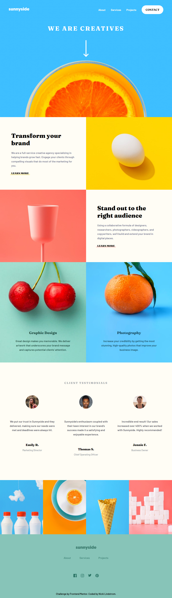

# Frontend Mentor - Sunnyside agency landing page solution

This is a solution to the [Sunnyside agency landing page challenge on Frontend Mentor](https://www.frontendmentor.io/challenges/sunnyside-agency-landing-page-7yVs3B6ef). Frontend Mentor challenges help you improve your coding skills by building realistic projects.

## Table of contents

- [Overview](#overview)
  - [The challenge](#the-challenge)
  - [Screenshot](#screenshot)
  - [Links](#links)
- [My process](#my-process)
  - [Built with](#built-with)
  - [What I learned](#what-i-learned)
  - [Continued development](#continued-development)
  - [Useful resources](#useful-resources)
- [Author](#author)

## Overview

### The challenge

Users should be able to:

- View the optimal layout for the site depending on their device's screen size
- See hover states for all interactive elements on the page

### Screenshot

### Links

- Solution URL: [Add solution URL here](https://your-solution-url.com)
- Live Site URL: [Add live site URL here](https://your-live-site-url.com)

## My process

### Built with

- Semantic HTML5 markup
- CSS Flexbox, CSS Grid
- Mobile-first workflow

### What I learned

- Using the picture tag to make images responsive between different media sizes
- Adjusting and centering absolute positioned components
- Changing the colour of images using css filter

### Continued development

I've gotten better with image manipulation since my last FEM project, but I still have lots of room to improve. Sizing, positioning images. Ensuring that important parts aren't cropped off.

## Author

- Frontend Mentor - [@Nickil13](https://www.frontendmentor.io/profile/Nickil13)
